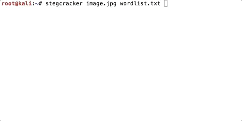

# StegCracker
Steganography brute-force utility to uncover hidden data inside files.

## Usage
Using stegcracker is simple, pass a file to it as it's first parameter and optionally pass the path
to a wordlist of passwords to try as it's second parameter. If this is not set it will default to the
rockyou.txt password file which ships with Kali Linux or can be downloaded [here](https://github.com/danielmiessler/SecLists/raw/master/Passwords/Leaked-Databases/rockyou.txt.tar.gz).

```
$ stegcracker <file> [<wordlist>]
```

## Installation
To install the program, follow these steps:

```
$ sudo apt-get install steghide -y
$ sudo curl https://raw.githubusercontent.com/Paradoxis/StegCracker/master/stegcracker > /usr/local/bin/stegcracker
$ sudo chmod +x /usr/local/bin/stegcracker
```

## Updating
To update the program, simply pass the `--update` argument instead of a file name.

```
$ sudo stegcracker --update
StegCracker - (https://github.com/Paradoxis/StegCracker)
Copyright (c) 2018 - Luke Paris (Paradoxis)

Updating StegCracker to the latest version.. DONE
```


## Example



## License
Copyright 2017 - Luke Paris (Paradoxis)

Permission is hereby granted, free of charge, to any person obtaining a copy of this software and associated documentation files (the "Software"), to deal in the Software without restriction, 
including without limitation the rights to use, copy, modify, merge, publish, distribute, sublicense, and/or sell copies of the Software, and to permit persons to whom the Software is furnished to 
do so, subject to the following conditions:

The above copyright notice and this permission notice shall be included in all copies or substantial portions of the Software.

THE SOFTWARE IS PROVIDED "AS IS", WITHOUT WARRANTY OF ANY KIND, EXPRESS OR IMPLIED, INCLUDING BUT NOT LIMITED TO THE WARRANTIES OF MERCHANTABILITY, FITNESS FOR A PARTICULAR PURPOSE AND 
NONINFRINGEMENT. IN NO EVENT SHALL THE AUTHORS OR COPYRIGHT HOLDERS BE LIABLE FOR ANY CLAIM, DAMAGES OR OTHER LIABILITY, WHETHER IN AN ACTION OF CONTRACT, TORT OR OTHERWISE, ARISING FROM, OUT OF 
OR IN CONNECTION WITH THE SOFTWARE OR THE USE OR OTHER DEALINGS IN THE SOFTWARE.
